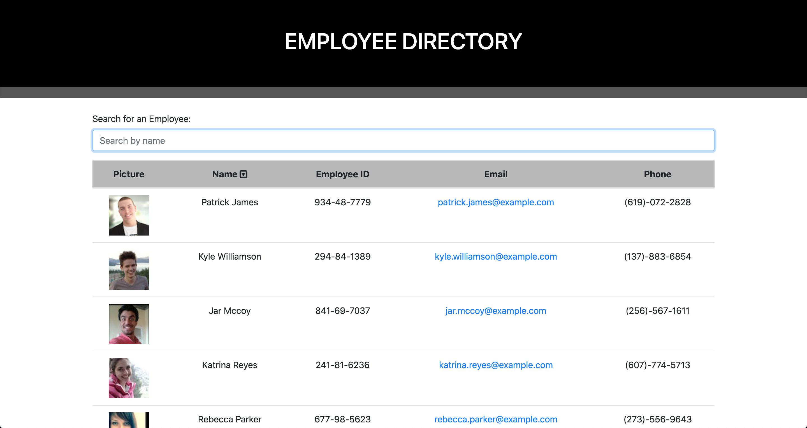

# Employee Directory

# Link to Application

[VIEW MY APPLICATION HERE!]()

## Table of Contents

* [Description](#Description)
* [Author](#Author)

## Description

An employee directory application developed with React using the ramdom user API. When the user loads the page, a table of employees renders with their pictures, names, employee id, email and phone number with the possibility to filer by typing in the input field and sorting by name.

## Author

**Christopher Hicks**

- Github: [chris31roc](https://github.com/chris31roc)

- Email: chris31roc@yahoo.com